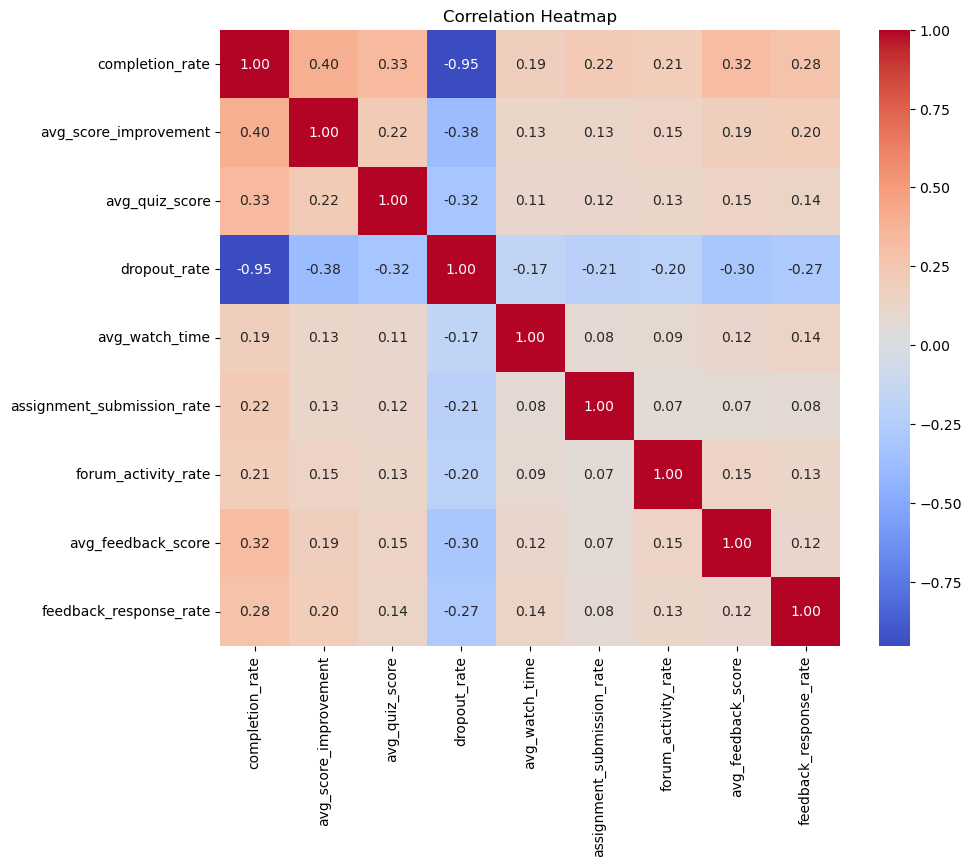
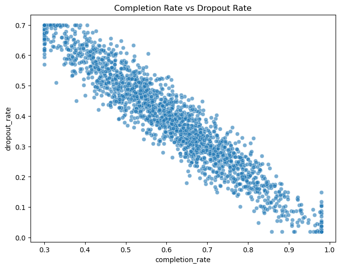
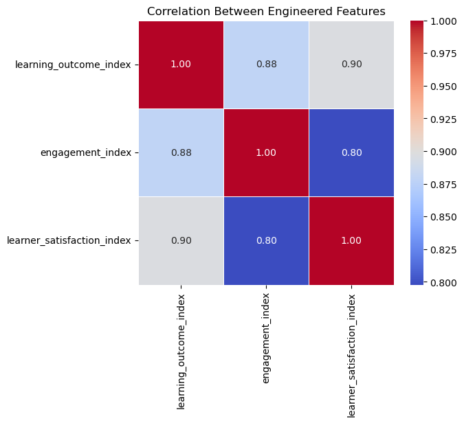
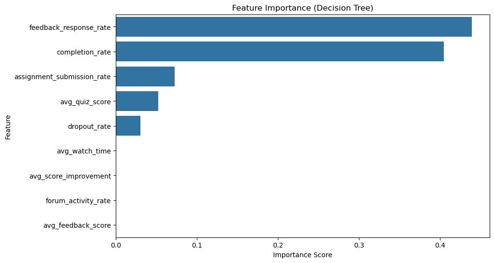

# 📊 Instructor Effectiveness Prediction using Machine Learning

> Predicting instructor effectiveness using learner engagement, academic performance, and feedback metrics through an end-to-end Machine Learning pipeline.


---

# 📌 Project Overview

Educational platforms generate large amounts of learner performance and engagement data, but evaluating instructor effectiveness objectively remains challenging.

This project develops a machine learning solution that predicts **Instructor Effectiveness Tiers (Low, Medium, High)** by analyzing learner outcomes, engagement, and feedback metrics. The workflow includes exploratory data analysis, feature engineering, instructor-level aggregation, model training, evaluation, and business recommendations.

---

# 🎯 Problem Statement

The objective is to identify the factors that contribute to effective teaching and build a classification model capable of predicting instructor effectiveness. Such insights can help EdTech organizations:

- Improve teaching quality
- Monitor instructor performance
- Increase learner engagement
- Support data-driven decision making

---

# 📂 Dataset

The dataset contains **2,000 learner records** across multiple instructors and includes metrics such as:

- Completion Rate
- Dropout Rate
- Average Score Improvement
- Average Quiz Score
- Watch Time
- Assignment Submission Rate
- Forum Activity Rate
- Average Feedback Score
- Feedback Response Rate

Since instructors teach multiple batches, learner-level records were aggregated into instructor-level features before training the models.

---

# 🛠️ Technologies Used

- Python
- Pandas
- NumPy
- Matplotlib
- Seaborn
- Scikit-learn
- Jupyter Notebook

---

# 📊 Exploratory Data Analysis

The project includes comprehensive exploratory data analysis:

- Missing value analysis
- Distribution analysis
- Correlation heatmaps
- Pairplots
- Scatter plots
- Feature relationship analysis
- Instructor-level aggregation

---

# ⚙️ Feature Engineering

To better represent instructor performance, several composite indices were created:

- **Learning Outcome Index**
- **Engagement Index**
- **Learner Satisfaction Index**
- **Instructor Effectiveness Score**

These engineered features were used to define instructor effectiveness before creating effectiveness tiers.

---

# 🤖 Machine Learning Models

Three classification algorithms were trained and compared:

- Logistic Regression
- Decision Tree Classifier
- Random Forest Classifier

The dataset was split into training and testing sets using an 80:20 ratio.

---

# 📈 Model Performance

| Model | Accuracy |
|--------|---------:|
| Logistic Regression | **83.33%** |
| Decision Tree | **87.50%** |
| Random Forest | **83.33%** |

🏆 **Best Model:** Decision Tree Classifier

---

# 📌 Key Findings

The Decision Tree model identified the following features as the most influential:

- Feedback Response Rate
- Completion Rate
- Assignment Submission Rate
- Average Quiz Score

These factors had the greatest impact on predicting instructor effectiveness.

---

# 📷 Project Visualizations

### Correlation Heatmap



---

### Completion Rate vs Dropout Rate



---

### Engineered Feature Correlation



---

### Feature Importance



---

# 💼 Business Recommendations

Based on the analysis, educational platforms should:

- Encourage timely instructor responses to learner feedback.
- Improve course completion through enhanced learner engagement.
- Promote assignment participation to improve learning outcomes.
- Monitor dropout trends and intervene early.
- Use data-driven insights to support instructor development rather than relying solely on subjective evaluations.

---

# 📁 Repository Structure

```
Instructor-Effectiveness-Prediction
│
├── images/
│   ├── correlation_heatmap.png
│   ├── completion_vs_dropout.png
│   ├── engineered_features_heatmap.png
│   └── feature_importance.png
│
├── Instructor_Effectiveness_Prediction.ipynb
├── instructor_effectiveness_dataset.csv
├── README.md
├── requirements.txt
├── LICENSE
└── .gitignore
```

---

# 🚀 Installation

Clone the repository:

```bash
git clone https://github.com/divyanshchauhan-ds/Instructor-Effectiveness-Prediction.git
```

Install dependencies:

```bash
pip install -r requirements.txt
```

Launch Jupyter Notebook:

```bash
jupyter notebook Instructor_Effectiveness_Prediction.ipynb
```

Open:

```
Instructor_Effectiveness_Prediction.ipynb
```

---

# 🔮 Future Improvements

- Hyperparameter tuning using GridSearchCV
- Cross-validation for robust evaluation
- XGBoost and LightGBM models
- SHAP-based model explainability
- Streamlit web application for deployment
- Real-time prediction dashboard

---

# 📚 Skills Demonstrated

- Exploratory Data Analysis (EDA)
- Feature Engineering
- Data Aggregation
- Machine Learning Classification
- Model Evaluation
- Feature Importance Analysis
- Data Visualization
- Business Insight Generation

---

# 👨‍💻 Author

**Divyansh Chauhan**

B.Tech CSE (Data Science)

📌 Passionate about Machine Learning, Data Analytics, and Building Real-World AI Solutions.

---

⭐ If you found this project interesting, consider giving the repository a star!